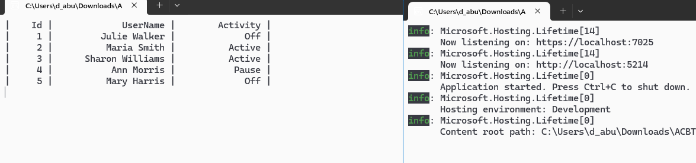

# Лабораторная работа на тему "HTTP"

## Описание проекта

Этот проект представляет собой клиентское приложение на C#, которое взаимодействует с RESTful API для управления задачами. Приложение позволяет получать список задач, отображать их и обновлять состояние активности задач с использованием HTTP-запросов.

## Установка

### Предварительные требования

- .NET SDK (версия 6.0 или выше)
- Доступ к серверу, работающему на `http://localhost:5214/api/`

### Шаги по установке

1. Клонируйте репозиторий:

   ```bash
   git clone <URL_репозитория>
   cd <имя_папки_репозитория>
   ```

2. Соберите проект:

   ```bash
   dotnet build
   ```

3. Запустите приложение:

   ```bash
   dotnet run
   ```

## Использование

После запуска приложение подключится к API и начнет получать информацию о задачах. Оно будет периодически обновлять состояние активности случайных задач.

### Основные функции

- **Подключение к API**: Клиент устанавливает соединение с API по адресу `http://localhost:5214/api/`.
- **Получение списка задач**: Приложение запрашивает и отображает список всех задач с их идентификаторами, именами и состоянием активности.
- **Обновление состояния задач**: Каждые 5 секунд приложение случайным образом выбирает задачу и обновляет её состояние активности.

## Объяснение кода

### Основной класс `Program`

- **`Main` метод**: Является точкой входа в приложение. Здесь создается объект `HttpClient`, который устанавливает базовый адрес для запросов к API.

  ```csharp
  var httpClient = new HttpClient()
  {
      BaseAddress = new Uri("http://localhost:5214/api/")
  };
  ```

- **`ManageTasks` метод**: Этот метод отвечает за управление задачами. Он получает список задач с сервера, отображает их и обновляет состояние активности.

  ```csharp
  var tasks = await taskApi.GetAllAsync();
  ```

### Управление задачами

- **Цикл обновления**: Внутри метода `ManageTasks` реализован бесконечный цикл, который выполняется до тех пор, пока приложение активно:
  - Получает список задач и очищает консоль для отображения новых данных.
  
    ```csharp
    Console.Clear();
    ```

  - Отображает информацию о каждой задаче в виде таблицы.
  
    ```csharp
    foreach (var task in tasks)
    {
        Console.WriteLine($"| {task.Id,5} | {task.Name,20} | {task.Active,15} | ");
    }
    ```

  - Генерирует случайные идентификаторы пользователей и состояния активности для обновления задачи.
  
    ```csharp
    int UserId = random.Next(1, 6);
    int ActivityId = random.Next(0, 3);
    ```

- **Обновление задачи**: После получения случайной задачи создается новый объект `TaskItem`, который затем отправляется на сервер для обновления.

  ```csharp
  var newTask = new TaskItem(
      id: task1.Id,
      name: task1?.Name,
      active: Array[ActivityId]
  );
  var addResult = await taskApi.UpdateAsync(UserId, newTask);
  ```

## Структура кода

- **`Program.cs`**: Основной файл приложения, содержащий логику подключения к API и управления задачами.
- **`TaskApiClient`**: Класс для взаимодействия с API задач на сервере.
- **`TaskItem`**: Модель данных для представления информации о задаче.

## Примечания

- Убедитесь, что сервер запущен и доступен перед запуском клиента.
- Для корректной работы необходимо, чтобы сервер поддерживал API, используемое в этом приложении.


## Работа программы


